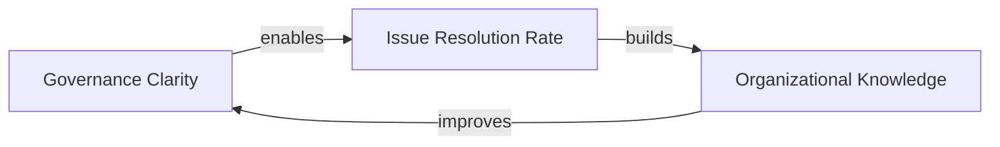
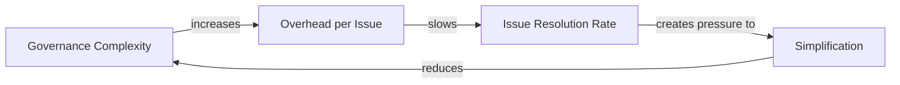

# Systems Thinking Standard

**Version**: v0.2.0  
**Issue**: [#3 — Governance: Integrate Systems Thinking as foundational cross-cutting approach](https://github.com/imranypatel/xp-org1/issues/3)  
**Status**: Active

---

## Overview

**Systems Thinking (ST)** is the foundational analytical lens for all work in `xp-org1`. Every domain — Operations, Finance, HR, Marketing, Infrastructure, Legal, and all others — is analyzed through ST before interventions are designed or executed.

ST is not a domain. It is the *epistemological framework* within which every domain operates. The same structural thinking applies whether the issue concerns hiring policies, payment processing, deployment pipelines, or customer churn.

> **ST vs SD**: This standard covers *Systems Thinking* — the qualitative, conceptual application. *Systems Dynamics* (SD) simulation (Vensim, Stella, AnyLogic) is deferred and will be addressed in a future issue when quantitative modeling is required.

---

## Core Elements

### 1. Stocks

A **stock** is any accumulation that exists at a point in time. It changes over time only through flows.

| Domain | Example Stocks |
|--------|---------------|
| Operations | Process backlog, operational knowledge, equipment condition |
| HR | Team capacity, employee morale, organizational skill level |
| Finance | Cash reserves, outstanding liabilities, capital assets |
| Marketing | Brand equity, customer awareness, content library |
| Infrastructure | System reliability, technical debt, security posture |
| CRM / Sales | Customer trust, pipeline volume, contracted revenue |
| Legal | Compliance standing, unresolved liabilities |
| Governance | Clarity of standards, issues resolved, known patterns |

### 2. Flows

A **flow** is the rate at which a stock fills or drains. Flows are always measured per unit of time.

| Flow Type | Examples |
|-----------|---------|
| Inflow (fills stock) | Hiring rate, feature delivery rate, revenue intake |
| Outflow (drains stock) | Churn rate, bug introduction rate, capital expenditure |
| Net flow | Growth rate = inflow − outflow |

### 3. Feedback Loops

Feedback loops are the engine of system behavior. All dynamics — growth, decay, oscillation, stability — arise from feedback.

#### Reinforcing Loops (R)

Self-amplifying. A change in one variable propagates around the loop and amplifies the original change. Can drive exponential growth *or* accelerating collapse.

```
Example (R1 — Governance Clarity):
Governance clarity → faster issue resolution → more issues documented
→ richer knowledge base → better governance → [reinforces start]
```



**Warning**: Reinforcing loops are self-amplifying in *both* directions. The same loop that drives growth drives collapse if the direction reverses.

#### Balancing Loops (B)

Goal-seeking. A change drives the system back toward a target state. These create stability, oscillation, and resistance to change.

```
Example (B1 — Governance Overhead):
Governance complexity → overhead per issue → resolution slowdown
→ pressure to simplify → reduced complexity → [balances back]
```



### 4. Delays

**Delays** are the most underappreciated source of system pathology. A delay between an action and its effect causes:

- **Oscillation** — corrective action overshoots because feedback arrives late
- **Policy resistance** — interventions appear not to be working, leading to abandonment
- **Counterintuitive behavior** — the worst outcomes often appear *after* the right action was taken

| Delay Type | Example |
|------------|---------|
| Perception delay | Time to notice customer churn is rising |
| Response delay | Time to hire after decision to grow team |
| Delivery delay | Time from code commit to production impact |
| Effect delay | Time from marketing campaign to revenue |

> **Rule**: When a system isn't responding as expected, check for delays *before* concluding the intervention failed.

### 5. System Archetypes

Archetypes are recurring structural patterns that produce predictable behaviors. Recognizing the archetype accelerates diagnosis and points to proven leverage.

| Archetype | Pattern | Example |
|-----------|---------|---------|
| **Limits to Growth** | Growth pushes against a constraint that slows or reverses it | Rapid delivery rate → rising technical debt → slowing delivery |
| **Fixes that Fail** | A short-term fix creates side effects that worsen the original problem | Add headcount to fix capacity → coordination overhead reduces output |
| **Shifting the Burden** | Symptomatic fix undermines capacity to address root cause | Patch production bugs instead of improving test coverage |
| **Escalation** | Two actors each respond to the other's actions, amplifying both | Competing teams each over-procure resources, inflating total cost |
| **Tragedy of the Commons** | Shared resource depleted by individually rational actions | Each team prioritizes own delivery speed, degrading shared infrastructure |
| **Eroding Goals** | Performance gaps are closed by lowering the standard rather than improving performance | SLA compliance achieved by weakening the SLA |
| **Success to the Successful** | Resources flow to the winner, starving others | High-visibility projects absorb budget, leaving critical maintenance unfunded |

### 6. Leverage Points (Meadows' 12)

Leverage points are places to intervene in a system, ranked from **least to most effective**. The counterintuitive insight: the most obvious intervention points (numbers, parameters) are usually the weakest.

| Level | Category | Example |
|-------|----------|---------|
| 12 | Constants / parameters | Adjusting a rate or number |
| 11 | Sizes of stocks and buffers | Increasing inventory buffer |
| 10 | Structure of stocks and flows | Restructuring a pipeline |
| 9 | Lengths of delays | Reducing feedback cycle time |
| 8 | Strength of balancing loops | Strengthening QA gates |
| 7 | Gain around reinforcing loops | Accelerating a growth engine |
| 6 | Structure of information flows | Making a key metric visible |
| 5 | Rules of the system | Policy changes |
| 4 | Power to change the system | Self-organization capability |
| 3 | Goals of the system | Changing what is optimized for |
| 2 | Paradigms / mindsets | Changing the mental model of the system |
| **1** | **Transcending paradigms** | **Recognizing that all paradigms are partial** |

> **Practical guidance**: Interventions at levels 1–5 are transformational but hard to achieve. Levels 6–9 are high-leverage and often feasible. Levels 10–12 produce marginal results and are where most conventional management attention goes.

---

## Applying ST to Issues

### When to perform ST analysis

| Issue type | ST Analysis required? |
|------------|----------------------|
| 🔴 High-risk (Payments, Finance, Legal) | **Required** |
| 🟡 Medium-risk, strategic or architectural | **Recommended** |
| 🟢 Low-risk, additive, purely mechanical | Optional |
| Any issue labeled `st/archetype` or `st/leverage-point` | **Required** |

### ST Analysis template

Add this section to the Agent Assessment comment on the issue:

```markdown
## 🔄 Systems Analysis

**Affected Stocks**: [What accumulates? e.g., team capacity, technical debt, customer trust]
**Affected Flows**: [What rates change? e.g., deployment frequency, churn rate, hiring rate]
**Feedback Loops**:
  - R (Reinforcing): [Loop description — or "None identified"]
  - B (Balancing): [Loop description — or "None identified"]
**Delays**: [Time lags with counterintuitive potential — or "None identified"]
**Archetype**: [Matching archetype — or "None identified"]
**Leverage Point**: [Meadows level 1–12 and justification]
**ST Labels**: [Which `st/` labels apply to this issue]
**Model**: [Link to docs/models/issue-N/ if a CLD is created — or "Not modeled"]
```

### Causal Loop Diagrams (CLDs)

CLDs are stored in `docs/models/issue-N/`. They use **Mermaid** syntax (rendered natively by GitHub).

**Notation rules:**
- Positive causal link (same direction): `A -->|increases| B`
- Negative causal link (opposite direction): `A -->|reduces| B`
- Label R or B loops in a comment above the diagram
- Keep diagrams focused — one key dynamic per diagram

See `docs/models/README.md` for file naming and directory structure.

---

## ST Labels

The `st/` label category is applied as optional auxiliary metadata on any issue:

| Label | Meaning |
|-------|---------|
| `st/reinforcing-loop` | Issue involves or targets a reinforcing (R) feedback loop |
| `st/balancing-loop` | Issue involves or targets a balancing (B) feedback loop |
| `st/delay` | Issue involves a system delay causing counterintuitive behavior |
| `st/archetype` | Issue matches a known SD archetype |
| `st/leverage-point` | Issue represents a high-leverage system intervention |
| `st/stock` | Issue primarily affects a system stock |
| `st/flow` | Issue primarily affects a system flow |

**Rule**: These are always auxiliary. They never replace `domain/`, `type/`, or `status/` labels.

---

## References

- Donella Meadows, *Thinking in Systems* (Chelsea Green, 2008)
- Donella Meadows, *Leverage Points: Places to Intervene in a System* (1999)
- Peter Senge, *The Fifth Discipline* (Doubleday, 1990)
- Jay Forrester, *Industrial Dynamics* (MIT Press, 1961) — foundational SD text
- Causal Loop Diagramming guide: [systemdynamics.org](http://www.systemdynamics.org)
