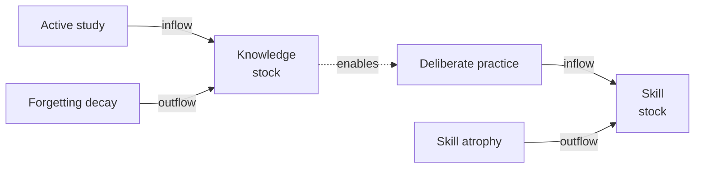
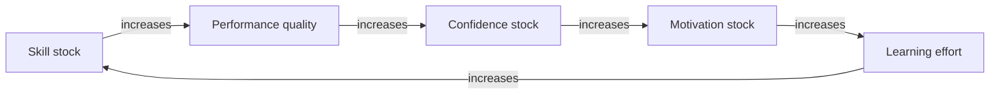
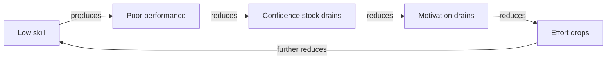
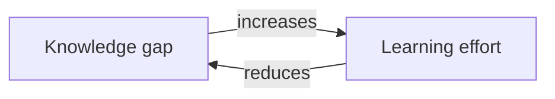

# Module 1: The Learning System — Introduction

**Level**: L1  
**Prerequisite**: [ST Foundations L1](../systems-thinking/module-1-introduction.md) — must understand stocks, flows, and basic feedback loops  
**Duration**: ~3–4 hours self-paced  
**Next**: [Module 1 Quiz](./assessments/module-1-quiz.md) → [Module 2](./module-2-practitioner.md)

---

## Part 1: Why Learning Is Not Linear

Ask most people how to learn better and they say: "Study more. Pay more attention. Work harder." This is linear thinking applied to learning — input in, output out, proportional relationship.

It does not explain why:
- A student who studies every day for 10 minutes retains far more than one who studies for 2 hours once a week
- A team that documents its processes consistently has less knowledge loss than one that holds a single "knowledge transfer session" before someone leaves
- A developer who writes code daily outpaces one who codes intensively in sprints
- Trying to learn too many things at once produces near-zero durable learning
- People who feel like experts after two weeks turn out to know much less than they thought

The difference is **system structure**, not effort level. Learning is not a pipeline. It is a feedback system.

### The Stocks of Learning

A stock is an accumulation — something that exists at a point in time, that inflows build and outflows drain.

Your learning system has several key stocks:

| Stock | What it is | What it feels like when high | What it feels like when low |
|-------|------------|------------------------------|------------------------------|
| **Knowledge stock** | Concepts, facts, models currently held in memory or retrievable | Quickly understand new information; make connections | Struggle to follow explanations; everything seems unfamiliar |
| **Skill stock** | Procedural ability to apply knowledge in practice | Actions feel automatic; fast, low-error execution | Actions feel effortful, slow, error-prone |
| **Confidence stock** | Belief in ability to perform and improve | Willingness to tackle difficult problems; resilience after setbacks | Avoidance; quitting at first failure; imposter syndrome |
| **Motivation stock** | Energy and drive directed toward learning | Self-initiated learning; persistence; curiosity | Learning feels like a chore; avoided unless required |

**Key insight**: These stocks interact. They are not independent.

### The Flows of Learning

**Inflows** (build the stocks):
- Active study: engaging with material (reading, watching, listening)
- Deliberate practice: attempting the skill with feedback
- Reflection: making sense of experience; updating mental models
- Teaching: explaining to others forces precision and reveals gaps

**Outflows** (drain the stocks):
- Forgetting decay: memory traces fade without retrieval practice
- Skill atrophy: procedural skills degrade without use
- Confidence erosion: failures, criticism, and comparison to others drain confidence
- Motivation depletion: burnout, boredom, and lack of visible progress drain motivation

**The linear trap**: People focus exclusively on inflows ("study more"). The stock drains from the other end. Total stock = inflows − outflows × time. If you double your study time but triple your forgetting rate (by cramming and never reviewing), your net knowledge stock shrinks.



---

## Part 2: Core Feedback Loops in Learning

### R1: The Competence Reinforcing Loop (Virtuous)



**Reading the loop**: More skill → better performance → more confidence → more motivation → more effort → more skill. Each turn of the loop amplifies the next. This is a virtuous **R1** reinforcing loop.

Once established, this loop is self-sustaining. The student who gets early wins builds confidence that drives the next learning cycle. The developer who builds a visible project generates momentum.

**The vicious version** (same loop, running in reverse):



The vicious spiral is the same loop running in the same direction — just starting from a different initial condition. This is why early failures in a learning sequence are so damaging: they can lock the loop into decline before it has gained momentum.

**Intervention implication**: Protecting early wins is high-leverage. Design learning sequences so that the first experiences of the topic produce success. Confidence is not a by-product of learning — it is a stock that feeds the loop. Protecting it is system design, not coddling.

### B1: The Gap-Closing Balancing Loop



This is a stabilizing **B1** balancing loop. When a gap exists, effort flows in to close it. As the gap shrinks, the pressure to study reduces naturally.

This is why motivated learners often slow down after they feel "good enough" — the balancing loop has reached near-equilibrium. The gap that was driving effort has been reduced.

**Important implication**: The B1 loop alone produces satisficing, not mastery. The learner stops when the gap is "small enough," not when they reach full competence. To push beyond satisficing, the R1 loop must take over — intrinsic motivation from the competence loop sustains learning when the gap-closing pressure has gone.

### Interaction: R1 Dominance vs. B1 Dominance

Early in learning, B1 dominates: there is a large gap, significant pressure, rapid initial progress. This is the "beginner's acceleration" phase.

As the gap shrinks, B1 weakens. If R1 is strong (competence is producing confidence and motivation), learning continues. If R1 is weak (early confidence was never built), learning stops at "good enough."

The **learning plateau** is often the moment when B1 has done its work and R1 has not yet engaged.

---

## Part 3: Delays in the Learning System

Delays are the invisible hand that make learning systems counterintuitive.

### The Effort-Before-Mastery Delay

There is always a gap between effort invested and competence demonstrated. Practice happens before mastery. Understanding happens before recall. This delay is fundamental to skill development.

**Effect on behavior**: Without awareness of this delay, learners conclude that effort is not working and quit — just before the competence emerges. The classic "I'm not good at this" declaration often happens at the plateau before the breakthrough, not at a genuine ceiling.

**System design implication**: Track effort invested, not just current performance. A learner who has practiced 50 hours is not "at the same level" as a beginner, even if their test score looks similar. The stock is accumulating; the outward performance signal lags.

### Consistency Beats Intensity: A Stock-Flow Argument

Consider two study patterns over 30 days:

**Pattern A (Intensity)**: 3 sessions of 4 hours = 12 hours total  
**Pattern B (Consistency)**: 30 sessions of 30 minutes = 15 hours total

Pattern B builds more durable knowledge stock. Why?

Because knowledge is a **leaky stock**. Forgetting is an outflow that runs continuously. Concentrated inflows (cramming) build a high stock briefly, but the outflow empties it rapidly before the next session. Distributed inflows (spaced practice) continuously top up the stock before it decays past the retrieval threshold.

This is Ebbinghaus's forgetting curve as a stock-flow model: the stock decays exponentially after each study event; only regular retrieval practice keeps it above the "accessible memory" threshold.

```
Knowledge stock:
Cramming:    ████░░░░░░░░░░░░░░░░░░░░░░░░░░  (spike then decay)
Consistent:  ████████████████████████████    (maintained above threshold)
```

### The Deceptive Competence Delay

Early learning produces a stock spike: new concepts are vivid, feel well-understood. But the skill stock is low — very little practice has built the procedural ability to apply them. The result: learners overestimate their competence immediately after studying.

This is the Dunning-Kruger effect reframed as a stock-flow problem: knowledge stock (recently spiked by study) is temporarily ahead of skill stock (which takes time to accumulate through practice). The learner feels competent — their knowledge stock is high — but their skill stock hasn't caught up yet.

**System design implication**: Assess skill (can they do it?), not just knowledge (can they describe it?). These are different stocks with different accumulation rates.

---

## Part 4: The Shallow-Learning Trap

The shallow-learning trap is the most common learning system failure:

- **High inflow, high outflow** = near-zero net stock accumulation

This is what happens during passive consumption: watching videos without notes, reading without retrieval, attending training without practice. The knowledge inflow is real — the material is being processed. But the outflow (forgetting decay) runs at the same rate, leaving near-zero net accumulation.

### Deep vs. Shallow Processing as Outflow-Rate Regulators

| Approach | Effect on outflow |
|----------|-----------------|
| Passive reading | High forgetting outflow — no retrieval trace |
| Note-taking | Moderate — encoding is deeper |
| Summarizing in own words | Lower — elaborative encoding |
| Retrieval practice (recall without notes) | Very low — strengthens the memory trace, counteracts forgetting outflow |
| Teaching someone else | Near zero — explaining forces precision and reveals gaps (gaps are re-encoded) |

The leverage point for improving net knowledge stock accumulation is **not** reading faster or watching more videos. It is switching from passive inflow (high outflow) to retrieval-practice inflow (low outflow). Same investment of time; dramatically different net stock.

---

## Part 5: Vocabulary Reference Card

| Term | Learning system meaning |
|------|------------------------|
| **Knowledge stock** | Accumulated concepts, models, facts currently retrievable |
| **Skill stock** | Procedural competence in applying knowledge |
| **Confidence stock** | Belief in ability; feeds motivation through R1 |
| **Motivation stock** | Energy and drive directed at learning |
| **Learning inflow** | Active study, deliberate practice, retrieval practice, reflection |
| **Forgetting outflow** | Memory decay; runs continuously; faster for passive encoding |
| **R1 Competence Loop** | Skill → success → confidence → motivation → effort → skill |
| **B1 Gap-Closing Loop** | Gap → effort → gap reduction → effort reduction |
| **Effort-before-mastery delay** | Practice does not immediately produce visible mastery |
| **Shallow-learning trap** | High inflow + high outflow = near-zero net stock |
| **Retrieval practice** | Recalling without notes; dramatically reduces forgetting outflow |
| **Spaced repetition** | Distributing practice over time to maintain stock above threshold |

---

## Worked Example: Developer Learning a New Framework

**Scenario**: A developer needs to learn a new web framework for an upcoming project. She has 4 weeks.

**Linear approach**: Read the entire documentation + watch 3 tutorials in week 1. Begin project in week 2. Struggle significantly.

**ST analysis**:

*Stocks*: Knowledge stock of framework concepts (low → built in week 1), skill stock (near zero throughout — no practice in week 1), confidence stock (high after week 1 study, then crashes in week 2 when the skill stock gap is revealed).

*Flows*: Inflow during week 1 (documentation reading — shallow encoding), high forgetting outflow (no retrieval). Net: knowledge stock drains during week 2 when she stops studying.

*Loops*: B1 (gap-closing) drove the intensive week 1 study. R1 (competence loop) never activated — there was no early win to build confidence.

*Delay*: Knowledge stock ≠ skill stock. She felt competent at end of week 1 (knowledge spike) but skill was near zero (no practice). The deceptive competence delay.

**Redesigned approach (structural)**:
- Week 1: Read docs (20%) + build small examples daily (80%) — activates practice inflow, builds skill stock alongside knowledge stock
- Week 2–4: Build project + daily retrieval practice (close one door, recall the API without reference) — maintains knowledge stock above threshold
- Track early wins → protects confidence stock → keeps R1 loop positive

*Result*: Skill stock and knowledge stock grow in parallel. R1 loop activates early. Knowledge is retrievable at week 4.

---

## Exercises

**Exercise 1.1 — Map your learning stocks**

Think of a skill you are currently learning (or recently learned). Name:
1. Your current knowledge stock level for this skill (low/medium/high)
2. Your current skill stock level (low/medium/high)
3. The gap between them — is knowledge ahead of skill, or skill ahead of knowledge?
4. One inflow that is currently active
5. One outflow that is currently active

**Exercise 1.2 — Identify your Competence Loop state**

For the same skill, determine:
1. Is the R1 Competence Loop currently running in the virtuous or vicious direction?
2. What event triggered the current direction?
3. What would it take to reverse direction if it is currently vicious?

**Exercise 1.3 — Draw a CLD of your learning system**

Using Mermaid syntax, draw the R1 and B1 loops for your chosen skill. Label each link (+/−). Mark any delays. Name the loops (%% R1: and %% B1:).

**Exercise 1.4 — Identify a delay you have experienced**

Describe in 3–5 sentences:
- What did you practice or study?
- How long before the effect of that effort became visible?
- How did the delay affect your behavior (did you quit? persist? overestimate competence)?

**Exercise 1.5 — Shallow vs. deep processing audit**

List the 3 learning activities you spend the most time on (e.g., reading, watching videos, writing code, attending meetings). For each, rate the forgetting outflow as High/Medium/Low. Then identify one substitution or complement that would reduce the outflow rate.

---

*When you are ready: [Take the Module 1 Quiz](./assessments/module-1-quiz.md)*
