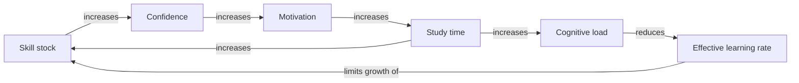
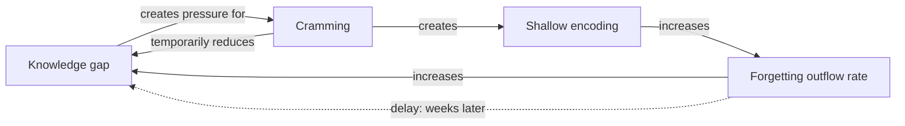
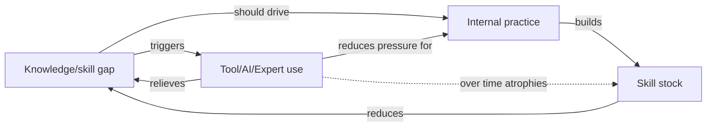
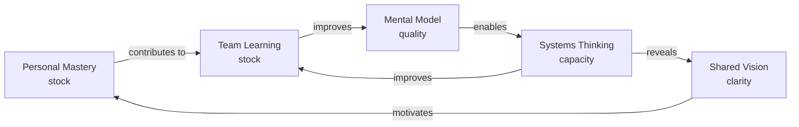

# Module 2: Learning System Design — Practitioner

**Level**: L2  
**Prerequisite**: [Module 1 Quiz](./assessments/module-1-quiz.md) passed (≥ 70%)  
**Duration**: ~6–8 hours self-paced  
**Next**: [Module 2 Quiz + Practicals](./assessments/module-2-quiz.md) → [Module 3](./module-3-mastery.md)

---

## Part 1: Learning Archetypes — Patterns That Trap Learners

You learned the 7 system archetypes in ST Foundations L2. Here you will see them running in the learning domain. Recognizing these patterns in your own learning is the first step to escaping them.

### Archetype 1: Limits to Growth — The Learning Plateau

**Pattern**: Growth accelerates through the R1 Competence Loop, then stalls when a constraining condition kicks in.

**In learning**:
- The reinforcing loop: skill → success → confidence → motivation → study → skill
- The constraining loop: as study time increases, cognitive load increases → mental fatigue increases → effective learning rate decreases → skill growth stalls



**The trap**: Pushing harder on the same inflow (more hours, more content) hits the constraint harder. The limiting condition is not effort — it is cognitive load, time, or attention span. Doubling study hours with already-high cognitive load produces diminishing returns or a crash.

**The leverage**: Address the limiting condition directly:
- Cognitive load: reduce material per session, use interleaving rather than massed practice, take deliberate rest
- Time: improve retrieval efficiency (same material in less time), reduce passive consumption
- Attention: remove distractions, use time-blocked deep work sessions

### Archetype 2: Fixes that Fail — Cramming

**Pattern**: A quick fix relieves the problem immediately but creates a side effect that makes the original problem worse over time.

**The quick fix**: Cramming — intensive study before a deadline → knowledge stock spikes → assessment passed → pressure relieved.

**The side effect**: Shallow encoding → high forgetting outflow → knowledge stock collapses within days. The original problem (lack of durable knowledge) is worse than if the cramming had not happened, because:
1. False confidence: the learner believes they "know" the material
2. No retrieval practice: the cramming encodes shallowly, and no review sessions were built in



**The leverage**: The symptomatic fix (cramming) is not wrong for a specific deadline — it is wrong as a default strategy. The fundamental fix is spaced retrieval practice: lower-intensity, higher-frequency inflows that maintain the knowledge stock above threshold without triggering the forgetting spike.

### Archetype 3: Shifting the Burden — The Tool/Expert Dependency Trap

**Pattern**: Relying on an external source (a tool, an expert, a lookup) to solve a problem, rather than building the internal capability. Over time, internal capability development atrophies because the burden has been shifted.

**In learning**:
- The problem: a knowledge or skill gap
- Symptomatic fix: always look it up, always ask the expert, always use AI to generate the answer
- Fundamental fix (neglected): practice retrieving and applying the knowledge yourself, build the internal model

**The trap**: The tool or expert is always available, so there is no pressure to develop internal capability. The skill stock never accumulates. The learner becomes more dependent over time, not less.



**The nuance**: Using tools is not bad — it is bad when it is a substitute for building understanding, not a complement to it. The test: can you do it without the tool? If the answer is permanently no, the burden has been shifted.

**The leverage**: Deliberate practice without the tool for learning-critical skills. Use the tool to check your work, not to do it.

### Archetype 4: Eroding Goals — The Learning Target Slide

**Pattern**: Under time pressure, learning targets are progressively lowered so that performance looks acceptable. The underlying gap remains.

**In learning**:
- Original goal: deep understanding + applied skill
- First revision under time pressure: "I just need to understand the concept, not be able to do it"
- Second revision: "I just need to know enough to contribute to the discussion"
- Third revision: "I can look it up when I need it"

**What was lost**: Each revision shifts the expected stock level lower. The actual knowledge/skill stock stays the same, but the standard moved to meet it. The team now believes the member is competent because they match the goal — the goal just drifted.

**The leverage**: External accountability with fixed, visible learning goals. Peer review of learning targets. Making the original goal explicit in writing before time pressure arrives.

---

## Part 2: Designing Your Personal Learning System

Understanding archetypes tells you what to avoid. Designing your system tells you what to build.

### Principle 1: Strengthen Inflows with Quality, Not Just Quantity

Not all inflows are equal. Passive reading has high forgetting outflow. Retrieval practice has near-zero forgetting outflow. For the same time investment, active recall builds exponentially more durable stock.

**High-quality inflows (low forgetting outflow):**
- **Retrieval practice**: close the book, recall everything you remember, then check
- **Spaced repetition**: review material at increasing intervals (day 1, day 3, day 7, day 14)
- **Interleaving**: mix different topics within a session (counterintuitive: feels harder but produces better retention)
- **Elaborative interrogation**: explain *why* something is true, not just what it is

**Lower-quality inflows (high forgetting outflow):**
- Passive re-reading
- Highlighting
- Watching without pausing to recall
- Listening without summarizing

### Principle 2: Reduce Outflows Structurally

You cannot eliminate forgetting, but you can reduce its rate:

| Structural change | Effect on outflow |
|-----------------|-----------------|
| Spaced retrieval schedule | Extends the decay curve; each retrieval restarts the timer |
| Teaching what you learned | Forces precision; gaps are re-encoded and fixed |
| Connecting new knowledge to existing knowledge stock | Durable encoding reduces future decay rate |
| Building projects with the new skill | Procedural practice locks in the skill stock |

### Principle 3: Protect the Competence Loop's Early Phase

The R1 Competence Loop depends on early wins to build the confidence stock. If the first experiences of a new skill are demoralizing, the vicious version activates.

**Design for early wins:**
- Start with the simplest, most concrete version of the skill
- Use worked examples before independent practice (reduces cognitive load during confidence-building phase)
- Measure progress against your own earlier performance, not against experts
- Name small wins explicitly: "I could not do this last week. I can do it today."

### Principle 4: Use the B1 Loop as a Signal, Not a Ceiling

When effort naturally reduces because the gap has closed, that is B1 reaching equilibrium — a signal, not an endpoint. If R1 has engaged (competence is generating motivation), learning will continue naturally. If R1 has not engaged, set the next deliberate stretch goal to re-activate B1.

The learning journey is: B1 dominates (gap-closing) → B1 weakens → R1 takes over (intrinsic motivation) → new B1 gap (set by next goal) → repeat.

---

## Part 3: Organizational Learning as a System — Senge's 5 Disciplines

Peter Senge's *The Fifth Discipline* describes five disciplines that define a **learning organization**. Viewed as a CLD, they are interconnected stocks and flows, not independent practices.

### The 5 Disciplines as Stocks

| Discipline | Stock it builds |
|-----------|----------------|
| Personal Mastery | Individual competence stock + motivation stock |
| Mental Models | Team's shared model quality (how accurately they see the system) |
| Shared Vision | Collective commitment stock (motivational alignment) |
| Team Learning | Team knowledge stock (greater than sum of individual stocks) |
| Systems Thinking | All of the above — the integrating discipline |

### The Organizational Learning CLD



The integrated reinforcing loop: personal mastery contributes to team learning, which improves mental models, which enables systems thinking, which reveals shared vision, which motivates personal mastery. This is the organizational equivalent of the R1 Competence Loop.

### Single-Loop vs. Double-Loop Learning (Argyris)

**Single-loop learning**: Detecting and correcting an error within the existing framework of goals, rules, and assumptions. The thermostat analogy — it detects that the temperature is off and corrects it, without questioning whether the temperature setting is right.

*Example*: A team notices that their deployments fail 30% of the time. They improve their testing coverage. Deployment failures drop to 10%. Single-loop — they fixed the action within the existing goal (reliable deployments).

**Double-loop learning**: Detecting and correcting an error by questioning and changing the underlying goals, rules, or assumptions — the thermostat setting itself.

*Example*: The same team asks: "Why do we deploy manually? What if the goal wasn't 'fewer failures' but 'zero-risk deployments'?" They redesign to continuous deployment with automated rollback. The goal, not just the action, has changed.

**ST framing**: Single-loop operates on flows (change the action). Double-loop operates on the structure of the system (change the goals, rules, or information flows). Meadows Level 12 vs. Levels 4–5.

**In practice**: Most organizational learning is single-loop because double-loop requires questioning assumptions that may be politically sensitive or deeply held. But the highest-leverage learning is always double-loop.

---

## Part 4: Applying the ST Analysis Template to a Learning Challenge

Let's walk through: "Why does our team keep making the same implementation mistakes after code reviews?"

```markdown
## 🔄 Systems Analysis

**Issue**: Team makes recurring implementation errors despite code review process
**Domain**: hr/training, it/development

**Affected Stocks**: 
- Team knowledge stock (of best practices)
- Code review effectiveness stock
- Developer confidence stock

**Affected Flows**:
  - Inflow: Code review feedback rate (knowledge transfer)
  - Outflow: Forgetting rate (feedback not retained); attrition (knowledge leaves with developers)

**Feedback Loops**:
  - B1 (Gap-closing): Error detected in review → correction made → error rate reduces → review pressure reduces
  - R1 (Competence — absent): If developer understands WHY the pattern is wrong, they stop making it → confidence builds → quality improves → less review burden → more time for learning
  - Problem: B1 is running but R1 never activates (developers fix the error without understanding the principle)

**Delays**: 
- Error pattern recurs because knowledge was not durably encoded (single fix, no retrieval practice)
- 2–4 week delay between review and recurrence

**Archetype**: Fixes that Fail — code review relieves the symptom (the specific error) but does not fix the fundamental (the developer's knowledge/skill stock).

**Leverage Point**: Meadows Level 6 — change information flow. Instead of reviewer fixing the error, reviewer asks "Can you explain why this approach is problematic?" — turns passive correction into active retrieval practice.

**ST Labels**: st/fixes-that-fail, st/delay, st/leverage-point
```

---

## Part 5: Meadows Leverage Points Applied to Learning

| Leverage Point | Learning application |
|---------------|---------------------|
| **Level 12 — Parameters** | Study session length, review interval, number of practice problems. Easy to change, low leverage. |
| **Level 11 — Buffer sizes** | Size of knowledge base, number of worked examples, breadth of practice set. Hard to change quickly. |
| **Level 9 — Delays** | Reducing the time between practice and feedback; spaced repetition optimizes this. |
| **Level 6 — Information flows** | Making learning progress visible (to self and team). Hidden progress → no motivation signal. Visible progress → R1 loop activated. |
| **Level 4 — Rules** | Organizational policies: "All developers attend a weekly learning session." Rules shape what inflows exist. |
| **Level 3 — Goals** | What the organization rewards: expertise depth or breadth? Speed of delivery or quality? Goals determine which stocks are invested in. |
| **Level 2 — Paradigms** | Growth mindset vs. fixed mindset as a mental model. The most powerful leverage in the personal learning system — it determines whether failure activates the vicious R1 or is treated as a signal to adjust strategy. |
| **Level 1 — Transcending paradigms** | Building meta-learning: learning how to learn as a system. This program. |

---

## Exercises

**Exercise 2.1 — Archetype diagnosis**

Identify one archetype from Part 1 that is currently active in your own learning. Describe:
1. What is the symptom being relieved (the quick fix)?
2. What is the fundamental fix being neglected?
3. What structural change would shift from the quick fix to the fundamental fix?

**Exercise 2.2 — Learning system audit**

List your top 3 learning activities. For each:
1. Which inflow quality tier does it fall into? (High/Medium/Low retrieval resistance)
2. Is it strengthening skill stock or only knowledge stock?
3. What one substitution or addition would improve it?

**Exercise 2.3 — Single-loop vs. double-loop**

Identify one recurring problem in your work domain that your team has "solved" multiple times. 
1. What was the single-loop fix applied?
2. What assumption or goal would need to be questioned to achieve a double-loop solution?
3. What stock would change if the double-loop solution were applied?

**Exercise 2.4 — Leverage point identification**

For a learning challenge in your domain, identify:
1. The current intervention being used (and its Meadows level)
2. A Level 6 alternative (change an information flow)
3. A Level 2 alternative (change a paradigm/mental model)

**Exercise 2.5 — Organizational learning stock audit**

Using Senge's 5 disciplines as stocks, rate your team's current level in each (Low/Medium/High) and identify the one with the lowest current stock. What structural intervention would most effectively build that stock?

---

*When you are ready: [Take the Module 2 Quiz + Practicals](./assessments/module-2-quiz.md)*
