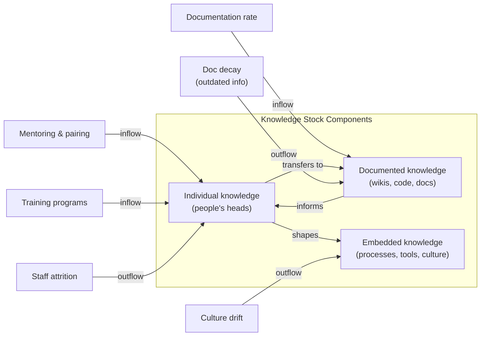
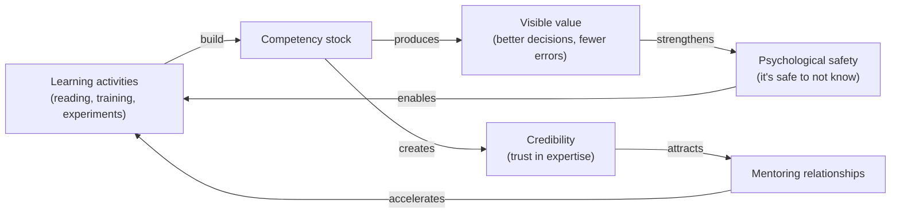
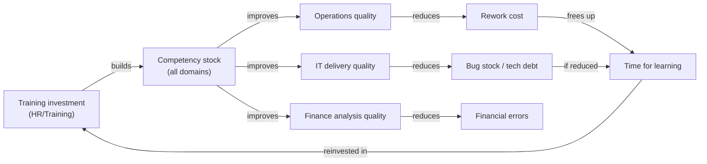

# Module 3: Organizational Learning — Mastery

**Level**: L3  
**Prerequisite**: Module 2 pass + ≥ 2 real learning challenge ST analyses in GitHub issues  
**Duration**: ~10–12 hours self-paced + portfolio assembly  
**Assessment**: [Module 3 Portfolio](./assessments/module-3-quiz.md)

---

## Part 1: The Organizational Learning System as a Multi-Loop Model

An organization does not learn the way an individual learns. There is no single "organizational brain" that accumulates knowledge. The organizational knowledge stock is **distributed** across team members, documents, processes, tools, and culture. This distribution creates both strength (redundancy) and fragility (concentration).

### The Organizational Knowledge Stock

**Key insight**: When a team member leaves, only the knowledge that was transferred to `DK` (documented) or `EM` (embedded in process) survives. Everything in `IK` (their head) exits with them. The **bus factor** is the number of people who, if they left tomorrow, would take irreplaceable knowledge with them.

Bus factor = 1 means the organization's knowledge stock is concentrated in one person. The stock is fragile — a single attrition event collapses it.

### Flows that Protect the Organizational Knowledge Stock

| Flow | Mechanism | ST framing |
|------|-----------|-----------|
| Documentation | IK → DK transfer | Inflow to documented stock |
| Pairing / shadowing | IK → IK transfer (direct) | Cross-individual knowledge diffusion |
| Process design | IK → EM (embedding decisions in repeatable structure) | Inflow to embedded stock |
| Onboarding | DK + EM → new IK | Inflow to new member's individual stock |
| Post-mortems | Failure experience → DK (via structured analysis) | Converting tacit to explicit knowledge |

The **documentation debt** problem: documentation rate (IK → DK) is chronically lower than the growth of IK, because writing is seen as overhead on the critical path. The organizational knowledge stock becomes increasingly concentrated in individuals rather than distributed — a growing fragility.

**Leverage**: Treat documentation as a flow maintenance requirement, not a nice-to-have. Every piece of non-trivial knowledge that exists only in one person's head is an undocumented outflow risk.

---

## Part 2: The Learning Culture Reinforcing Loop

A learning organization sustains its knowledge stock through a cultural reinforcing loop:

**R1 (Learning Culture)**: Learning → competence → visible value → psychological safety → more learning. This loop requires psychological safety as an intermediate stock. Without the belief that "it is safe to not know something," members stop learning visibly — they only display competence, never gaps. This prevents the next learning cycle from starting.

**The vicious version**: Expertise is rewarded and ignorance is penalized → members hide knowledge gaps → no learning activities are visible → culture reinforces "know it or fake it" → psychological safety collapses → R1 runs in reverse.

**Intervention**: Psychological safety is the lynchpin stock in the organizational learning loop. Protecting it is not "soft culture work" — it is structural maintenance of the reinforcing loop that enables organizational learning.

### Conditions That Weaken the Learning Culture Loop

| Condition | Effect on loop |
|-----------|---------------|
| Learning time never allocated (time pressure constant) | B constraint suppresses inflow; loop starves |
| Failures are penalized, not analyzed | Visible value of learning drops (learning ≠ safe); PsySafety stock drains |
| Senior members don't learn publicly | Implicit rule: "learning is for juniors"; psychological safety weakens for seniors |
| Learning is individual, not shared | Mentoring flow never activates; R2 loop never starts |
| No visible tracking of competency growth | Signal from VisibleValue is weak; motivation not sustained |

---

## Part 3: Cross-Domain Interactions — The Competency Multiplier

Competency built in HR/Training does not stay in HR. It flows across domain boundaries. This is the multiplier effect of learning investment.

**Reading the CLD**: Training investment builds competency across all domains → domain quality improves → error/rework costs drop → time freed up → reinvested in training. This is a reinforcing loop with a long delay (weeks to months between training and visible domain quality improvement).

**The delay trap**: Organizations cut training budgets when under time pressure, exactly when the time-freeing effect of competency is most needed. The delay means the benefit of current training investment is invisible during the time pressure window. The B constraint (time pressure) suppresses the very inflow (training) that would eventually relieve it.

**Structural fix**: Treat training investment as a capital allocation with a delayed return, not an operational cost to cut. Decision rule: maintain training investment rate even under time pressure, because the return on current investment has not yet arrived.

### The Cross-Domain Knowledge Transfer Flow

When a team member applies ST analysis to an issue in one domain (e.g., a Finance billing cycle problem), their analysis:
1. Contributes to the documented knowledge stock (the ST analysis is in the issue)
2. Demonstrates the paradigm to adjacent domain members (visibility effect)
3. Enables cross-domain pattern recognition (the Escalation archetype in Sales looks the same as Escalation in IT infrastructure)

This is why Issue-level ST analysis is not just a documentation requirement — it is an active knowledge diffusion mechanism that builds organizational ST competency beyond the formal training path.

---

## Part 4: Facilitating a "Our Learning System" Retrospective

This 60-minute session maps the team's collective learning system and identifies structural interventions. It is a practical application of the entire LaaS curriculum.

### Pre-Session Preparation (15 minutes)

1. **Gather data**: What training has been completed in the last 6 months? What were the last 3 significant knowledge failures (a member didn't know something they were expected to know)?

2. **Prepare the canvas**: A whiteboard or shared document with three sections:
   - Current state: stocks, flows, loops we can observe
   - Vulnerabilities: outflows running uncontrolled; stocks at risk
   - Interventions: structural changes to address the vulnerabilities

3. **Set expectations**: This session is not about blame. The knowledge gaps are not individual failures — they are structural failures (missing inflows, high outflows, broken loops).

### Session Structure

**Opening (5 min)**: Frame the question as a system question. "We're not here to figure out who doesn't know what. We're here to figure out why our collective knowledge stock isn't as high as we need it to be."

**Step 1 — Map the stocks (10 min)**
Ask: "What are the things our team needs to know to do our work well?" Map them as knowledge/skill stocks. Rate each: High / Adequate / At Risk.

**Step 2 — Map the flows (10 min)**
Ask: "How does knowledge get into this team?" (inflows: training, documentation, pairing, external learning). "How does knowledge leave this team?" (outflows: attrition, documentation decay, no retrieval practice, silos). For each flow, estimate: Strong / Weak / Absent.

**Step 3 — Identify loops (10 min)**
Ask: "Are there learning reinforcing loops operating? Is there a culture of visible learning? Is there a gap-closing culture, or does learning stop when 'good enough' is reached?"

**Step 4 — Identify the critical vulnerability (5 min)**
One stock that is At Risk + one flow that is Weak/Absent = the highest-risk combination. Name it explicitly: "Our [X] stock is at risk because [Y] outflow is running uncontrolled and [Z] inflow is too weak."

**Step 5 — Propose structural interventions (10 min)**
For each vulnerability: what would strengthen the inflow? What would reduce the outflow? What leverage point are we operating on? Generate options, then select one to action.

**Close (10 min)**: Assign one owner per selected intervention. Set a 4-week check-in to assess whether the structural change is having the expected effect. Document the session output as a CLD or written ST analysis and commit it to `docs/models/` or the relevant GitHub issue.

### Facilitation Pitfalls

| Pitfall | What it looks like | How to redirect |
|---------|------------------|-----------------|
| Blame attribution | "The problem is that [person] doesn't document" | Redirect: "What would make documentation the default behavior, not the exception?" |
| Symptomatic fixes | "We should just make training mandatory" | Ask: "What structural condition is preventing people from choosing training?" |
| Loop skipping | Jumping to solutions before mapping stocks and flows | Enforce the sequence: map stocks → map flows → identify loops → then solutions |
| Scope creep | Discussion drifts to unrelated domain issues | "Is this a learning system issue? If yes, let's keep it in. If not, park it." |
| Optimism bias | "Our learning culture is fine" | Use the data from pre-session preparation: concrete knowledge failures are evidence |

---

## Part 5: Train-the-Trainer

L3 certification creates an obligation, not just an achievement. Once you have completed the portfolio, you become part of the learning infrastructure — a flow that builds the organizational knowledge stock.

### Mentoring an L1 Learner

**Your role**: Create early wins (protect their competence loop from going vicious early), ask questions that activate retrieval practice (not just supply answers), and make the system structure visible when they hit a plateau.

**Practical approach**:
1. Review their Module 1 quiz before discussing results — identify *why* they got wrong answers, not just which ones
2. Ask them to explain concepts to you (teaching as retrieval practice)
3. When they hit a plateau, name it structurally: "Your B1 gap-closing loop has done its work. The gap feels smaller. Now we need R1 to activate — let's find a challenge that creates a win."

### Facilitating L2 Archetype Recognition

L2 learners often intellectually understand archetypes but cannot recognize them in their own situation. Help by:
1. Asking about a persistent learning problem they have ("Why do I always forget X?")
2. Walking through each archetype: "Does this sound like Fixes that Fail? Do you have a quick fix for the symptom but a deeper issue unaddressed?"
3. Helping them commit a CLD — the act of drawing forces precision and reveals gaps in their own mental model

### Reviewing an L3 Portfolio

When reviewing a colleague's L3 portfolio:
1. **ST analyses**: Do they identify the actual structural cause, or just describe the symptoms in ST vocabulary?
2. **CLD**: Does it close? Does it reveal something non-obvious? A CLD that just draws what everyone already knew has low analytical value.
3. **Facilitation**: Was the output actionable? Did the team agree to a structural intervention, or just a list of "we should do better at X"?
4. **Peer coaching**: Did the colleague actually change their learning design, or just receive advice?

The standard for L3 is evidence of impact, not evidence of understanding.

---

## Portfolio Assembly Guide

Your portfolio demonstrates that you have applied Learning as a System thinking in real, verifiable ways.

### What makes a strong portfolio entry

**Strong**: An ST analysis that changed what the team decided to do. A CLD that revealed a structural cause that was not previously visible. A facilitated session where the team committed to a specific structural intervention. A peer coaching session where the colleague redesigned their learning approach.

**Weak**: An ST analysis that confirmed what everyone already knew. A CLD that maps a flow without identifying any loop. A facilitated session that produced a list of topics to study. A peer coaching session where you told the colleague what to do.

### Evidence submission locations

- ST analyses: GitHub issue comments using the ST Analysis template
- CLDs: `docs/models/issue-N/cld-{slug}.md` committed to main
- Facilitation session: a document (GitHub issue comment, PR description, or committed doc) describing who attended, what was mapped, and what was decided
- Peer coaching: brief note in the progress tracker confirming the session and linking to any produced artefact

---

*When you are ready: [Complete the Module 3 Portfolio Assessment](./assessments/module-3-quiz.md)*
