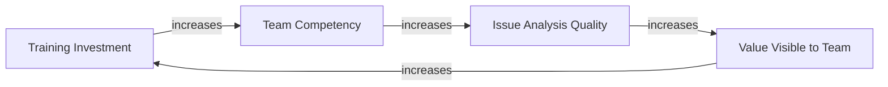
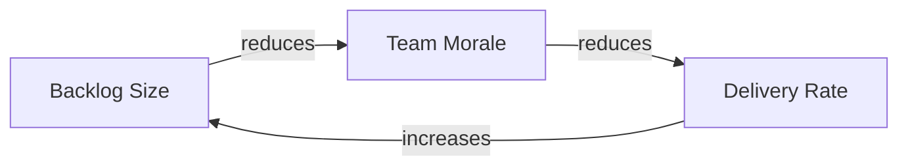
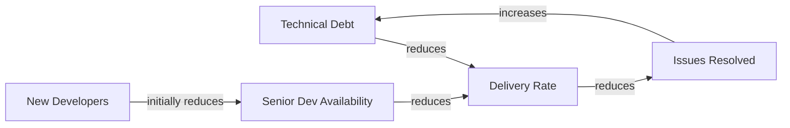

# Module 1 — Introduction to Systems Thinking

**Level**: L1 — Introduction  
**Program**: [Systems Thinking Foundations](./overview.md)  
**Duration**: ~3–4 hours self-paced  
**Prerequisite**: None  
**Assessment**: [Module 1 Quiz](./assessments/module-1-quiz.md)

---

## Part 1: The Problem with Linear Thinking

Most of us are trained to think in straight lines: *A causes B causes C*. Someone makes a bad decision → a problem occurs → fix the decision → problem goes away. This is linear, cause-and-effect thinking. It works for simple, one-way relationships.

But real organizations are not simple. They are **systems** — collections of interconnected parts whose behavior emerges from *structure*, not from the intentions or skills of the people inside them.

### What linear thinking misses

Consider a common scenario in software delivery:

> A team is behind schedule. Management adds more developers. Delivery gets slower — not faster.

A linear thinker concludes the new developers are bad or the team is mismanaged. A systems thinker asks: *What is the structure that produced this outcome?*

The answer: new developers require onboarding. Onboarding consumes time from senior developers — precisely the people doing the critical work. The new hires create a short-term drain before they contribute. This is not a people problem. It is a **structural** dynamic known as *Limits to Growth*. The linear fix (add people) does not fix the structural problem (onboarding overhead depletes the existing team's capacity).

> **Key shift**: Stop asking "who is to blame?" Start asking "what is the structure that makes this behavior almost inevitable?"

### Why this matters for every domain

| Domain | Linear view | Systems view |
|--------|------------|-------------|
| HR | "We need more people" | "Hiring drains training capacity before it adds delivery capacity" |
| Finance | "Cut expenses to improve cash flow" | "Cutting marketing dries up the revenue pipeline 6 months later" |
| IT | "Deploy more frequently to fix this bug faster" | "Each deployment without stable tests increases the bug introduction rate" |
| Marketing | "Run more campaigns to grow awareness" | "Brand equity built slowly; campaigns without retention planning drain the stock" |
| Operations | "Work harder to clear the backlog" | "Rushing creates errors that reenter the backlog — the backlog is self-replenishing" |

---

## Part 2: Stocks — What Accumulates

A **stock** is any quantity that accumulates or depletes over time. Stocks are the "memory" of a system. They change slowly, even when flows change rapidly. This is why systems often feel sluggish: the stock has not yet responded to what the flow started doing.

### Recognizing stocks

Stocks are things you can *measure at a point in time*:
- Bank balance (right now: $42,000)
- Number of open issues in the backlog (right now: 73)
- Team morale (right now: high/medium/low)
- Organizational knowledge (right now: sufficient/insufficient)
- Customer trust (right now: strong/fragile)
- Technical debt (right now: low/moderate/high)

If you can ask "how much of X is there right now?", it's a stock.

### Stocks have inertia

Stocks cannot jump instantly. A company with strong brand equity does not lose it in a day (but loses it over months of bad behavior). A team with low morale does not become energized from a single all-hands meeting. Understanding stock inertia prevents unrealistic expectations about how fast interventions work.

### Stocks in your domain

Before moving to Part 3, identify 3–5 stocks in your primary domain:

| Domain | Example stocks |
|--------|---------------|
| HR | Team capacity (person-hours available), organizational skill level, employee morale, cultural knowledge |
| Finance | Cash reserves, outstanding receivables, capital assets, unresolved liabilities |
| Operations | Process backlog, operational knowledge, equipment reliability |
| IT / Infrastructure | System reliability, technical debt, security posture, deployment pipeline stability |
| Marketing | Brand equity, customer awareness, content library, campaign ROI pool |
| Sales / CRM | Customer trust, pipeline volume, contracted revenue, relationship depth |
| Legal | Compliance standing, unresolved liabilities, contract coverage |
| Governance | Standards clarity, documented patterns, resolved issues |

> **Exercise 1.1**: Write down the 3 most important stocks in your domain. For each: what would it look like if the stock were depleted? What consequences would follow?

---

## Part 3: Flows — What Changes Stocks

A **flow** is the rate at which a stock fills or drains. Every change to a stock happens through a flow. There are two types:

| Flow type | Direction | Example |
|-----------|-----------|---------|
| **Inflow** | Fills the stock | Hiring rate, feature delivery rate, revenue intake, new customer acquisitions |
| **Outflow** | Drains the stock | Employee departures, bug introduction rate, expenses, customer churn |

The stock at any moment = previous stock + (inflow × time) − (outflow × time)

### The bathtub analogy

Think of any stock as a bathtub. The faucet (inflow) fills it. The drain (outflow) empties it. The water level (stock) at any moment depends on the *relative rates* of both, not on just one of them.

Common management error: focus exclusively on increasing the inflow (hire more, sell more, produce more) while ignoring outflows (churn, defects, waste). The stock stagnates or drains despite the inflow increase.

### Flows are rates, stocks are levels

- Stock: "We have 80 open issues" ← a level at a point in time
- Flow: "We are closing 5 issues per week and opening 8" ← a rate over time
- Future stock: 80 + (8−5) × 4 weeks = 80 + 12 = 92 open issues in 4 weeks

Understanding that the net flow determines future stock levels is the foundation of anticipating — rather than reacting to — organizational problems.

> **Exercise 1.2**: For each stock you identified in Exercise 1.1, name the primary inflow and the primary outflow. Which one is currently dominant? Is the stock growing or shrinking?

---

## Part 4: Reading Causal Loop Diagrams

A **Causal Loop Diagram (CLD)** shows how variables influence each other. It is the primary visualization tool in Systems Thinking. You will read CLDs in issue analyses throughout the governance workflow.

### Basic notation

```
A --→ B        A causes B to increase (same direction — positive link)
A --⊣ B        A causes B to decrease (opposite direction — negative link)
```

In Mermaid (how CLDs are written in this repo):
```
A -->|increases| B
A -->|reduces| B
```

### Reading a simple CLD



Reading this: Training investment increases team competency → competency improves issue analysis quality → better analyses make the value of training visible → visible value motivates more training investment. This is a **self-reinforcing loop** — it amplifies itself in either direction.

### Two types of causal links

| Link type | Symbol | Meaning | Example |
|-----------|--------|---------|---------|
| Positive (+) | `→` | When A goes up, B goes up (or when A goes down, B goes down) | Revenue increases → Profit increases |
| Negative (−) | `⊣` | When A goes up, B goes down (or vice versa) | Errors increase → Trust decreases |

> **Exercise 1.3**: Read this CLD and answer the questions below.



Questions:
1. What happens to Backlog Size when Delivery Rate decreases?
2. If Team Morale drops sharply, what happens to Delivery Rate?
3. If Delivery Rate increases (a positive change), what happens to Backlog Size?
4. Is this loop a growth engine or a collapse spiral? Why?

*(Answer key in Module 1 Quiz)*

---

## Part 5: Delays — The Hidden Agent of Surprise

A **delay** is a gap between an action and its effect. Delays are the single most common cause of counterintuitive system behavior.

### Why delays cause problems

1. **Oscillation**: You take corrective action. Nothing happens immediately (delay). You take *more* corrective action. The first action's effect finally arrives — now the system has overcorrected. You correct back the other way. The system oscillates.

2. **Policy resistance**: You intervene. The delay means results don't appear. You conclude the intervention didn't work and abandon it. The effect arrives after you've given up — you never see it.

3. **The delay illusion**: The worst outcomes appear *after* the right action was already taken. A market downturn hits six months after the risky investment was made, not the day of. Causality is hard to trace.

### Types of delays in organizational work

| Delay type | Example |
|------------|---------|
| **Perception delay** | Time between a problem starting and someone noticing (e.g., gradual churn increase) |
| **Decision delay** | Time between noticing a problem and deciding to act |
| **Implementation delay** | Time between decision and action taking effect |
| **Effect delay** | Time between action and visible result (e.g., marketing campaign → revenue) |

### The rule

> **When a system isn't responding as expected, check for delays before concluding the intervention failed.**

And the corollary: **Don't overcorrect**. If you've acted and results haven't appeared, ask yourself if a delay explains the lag before escalating the intervention.

> **Exercise 1.4**: Identify one delay in your domain that has caused a problem in the past. Describe: (a) what action was taken, (b) what the delay was, (c) what the observable symptom was (oscillation, resistance, or surprise).

---

## Part 6: Vocabulary Reference Card

Use this card whenever you read an issue analysis or ST assessment:

| Term | Definition | Memory aid |
|------|-----------|-----------|
| **Stock** | An accumulation that exists at a point in time | "How much is there *right now*?" |
| **Flow** | A rate that fills or drains a stock | "How fast is it changing?" |
| **Inflow** | A flow that increases a stock | Faucet filling the bathtub |
| **Outflow** | A flow that decreases a stock | Drain emptying the bathtub |
| **Reinforcing loop (R)** | A feedback loop that amplifies change (+ or −) | Snowball rolling downhill |
| **Balancing loop (B)** | A feedback loop that resists change, seeks a target | Thermostat |
| **Delay** | A time gap between cause and effect | Echo after the shout |
| **Archetype** | A recurring structural pattern with predictable behavior | A named plot structure |
| **Leverage point** | A place in the system where small change has large effect | The fulcrum of a lever |
| **CLD** | Causal Loop Diagram — a map of system variables and their causal links | A road map of cause and effect |
| **Positive link (+)** | When A increases, B increases (same direction) | Accelerator |
| **Negative link (−)** | When A increases, B decreases (opposite direction) | Brake |

---

## Part 7: Putting It Together — A Worked Example

Let's trace a complete scenario using all the concepts from this module.

**Scenario**: A software product team notices that its issue resolution rate has been declining for three months despite adding two new developers.

**Stock analysis**:
- Stocks: Team capacity (person-days), Technical debt, Team knowledge, Open issue count

**Flow analysis**:
- Inflows: New issues created, Technical debt accumulation rate
- Outflows: Issues resolved, Technical debt addressed

**CLD**:



**Delay**: New developers take 4–8 weeks to become productive. During onboarding, they consume senior developer time.

**What's happening**: Technical debt is an outflow constraint — it reduces delivery rate. Adding developers temporarily *depletes* the senior developer availability stock (through onboarding overhead), worsening the constraint before the new capacity materializes.

**What linear thinking prescribes**: Add more developers (again).

**What systems thinking prescribes**: Address the technical debt stock (the actual constraint on delivery rate). The new developers, once onboarded, will contribute — but adding more before the first wave is onboarded will make things worse.

> **Exercise 1.5**: Choose a persistent problem in your domain (something that keeps coming back despite repeated "fixes"). Draw a simple stock-flow-loop diagram using the vocabulary from this module. Identify: the key stock, the primary inflow and outflow, and whether there is a delay between action and effect.

---

## Module Summary

| Concept | One-line recap |
|---------|---------------|
| Systems thinking | Behavior emerges from structure, not from intentions |
| Stock | Accumulation that exists right now; changes slowly |
| Flow | Rate of change to a stock; can be in or out |
| CLD | Map of causal links between variables |
| Positive link | A → B, same direction |
| Negative link | A ↑ → B ↓ |
| Delay | Time gap between cause and effect; source of oscillation and surprise |

---

## Next Step

Take the [Module 1 Quiz](./assessments/module-1-quiz.md). Passing threshold: **70% or higher**.

After passing, you can begin [Module 2 — Practitioner](./module-2-practitioner.md).
