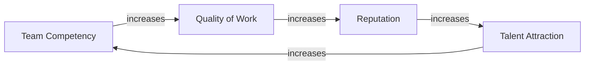
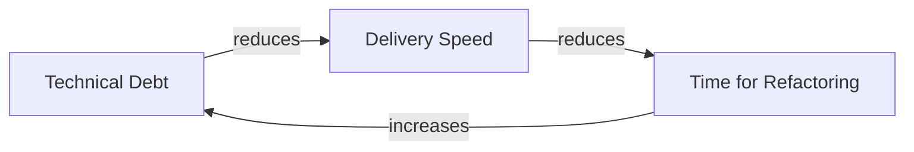
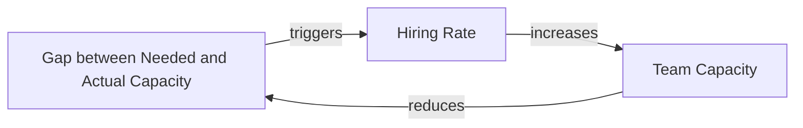
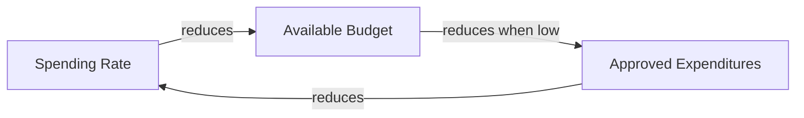
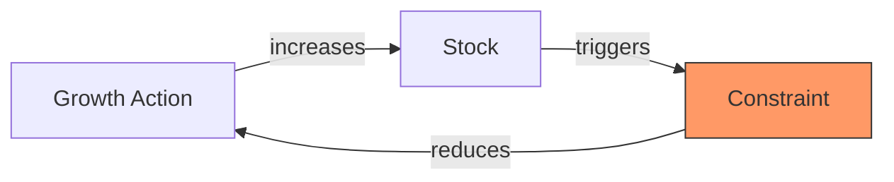
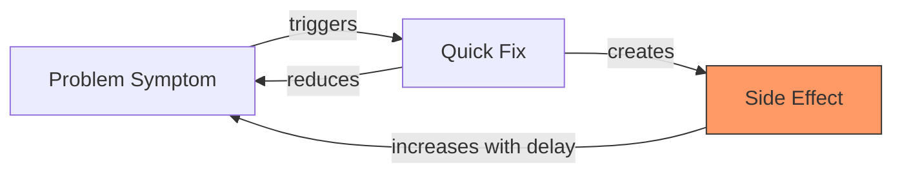
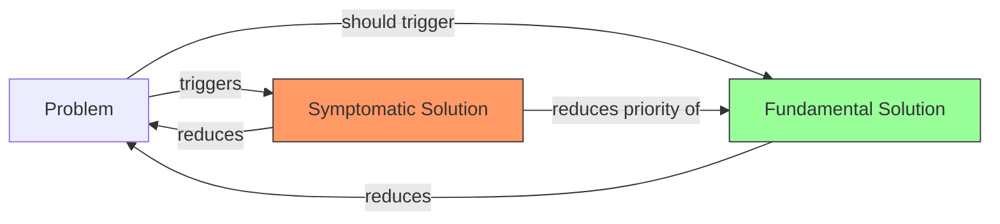
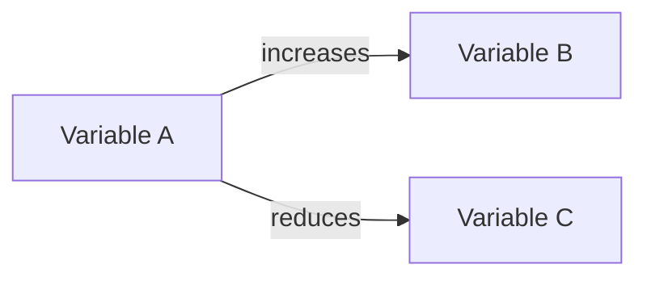
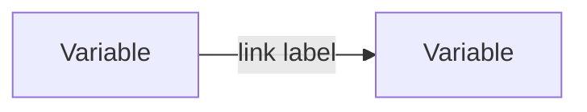

# Module 2 — Practitioner: Loops, Archetypes, and Analysis

**Level**: L2 — Practitioner  
**Program**: [Systems Thinking Foundations](./overview.md)  
**Duration**: ~6–8 hours self-paced  
**Prerequisite**: Module 1 Quiz ≥ 70%  
**Assessment**: [Module 2 Quiz](./assessments/module-2-quiz.md)

---

## Part 1: Feedback Loops — Deep Dive

In Module 1 you learned that CLDs show causal links. Now we examine the loops those links form — the engine of all system behavior. **Every dynamic we observe in organizations — growth, stagnation, oscillation, collapse — is produced by feedback loops.**

### What is a feedback loop?

A feedback loop exists when a chain of cause-and-effect relationships closes back on itself. The output of a process becomes an input to the same process. There are exactly two types.

---

### Reinforcing Loops (R)

A reinforcing loop amplifies change. Whatever direction the system is moving, a reinforcing loop pushes it further in that direction. Reinforcing loops produce:

- **Exponential growth** (when moving in a positive direction)
- **Accelerating collapse** (when moving in a negative direction)

They are neither good nor bad — they are structural amplifiers.

**How to identify a reinforcing loop**: Count the negative links in the loop. A loop is reinforcing when it has an **even number** (including zero) of negative links.

**Example — The Capability Flywheel (R1)**:



Higher competency → better work quality → stronger reputation → better talent joins → higher competency. This loop is self-amplifying. The same loop runs in reverse: talent loss → declining quality → reputation damage → further talent loss → accelerating collapse.

**The management implication**: A reinforcing loop in decay must be reversed at its weakest link — the point where the smallest intervention can break the cycle. Trying to fix the loop at its strongest point (where momentum is already high) costs the most.

**Example — Technical Debt Spiral (R2)**:



Technical debt slows delivery → less time is available for cleanup → debt accumulates faster. This is a reinforcing loop driving *collapse*. The system accelerates toward its own constraint.

---

### Balancing Loops (B)

A balancing loop is goal-seeking. It resists change and pushes the system toward a target state (which may be explicit — like a budget — or implicit — like "the way we've always done this"). Balancing loops produce:

- **Stability** (when the target is well-defined and delays are short)
- **Oscillation** (when delays are long)
- **Policy resistance** (when the goal itself resists change)

**How to identify a balancing loop**: Count the negative links. A loop is balancing when it has an **odd number** of negative links.

**Example — Hiring Balancing Loop (B1)**:



The gap between needed and actual capacity triggers hiring. Hiring increases capacity. Increased capacity closes the gap. The loop is self-correcting — but only as fast as the hiring delay allows. If the delay is 6 months, the gap persists visibly for months even after the correct action (hiring) was taken.

**Example — Budget Balancing Loop (B2)**:



The system corrects spending toward the available budget. If the delay between expenditure approval and spending recognition is long, the system oscillates around the budget target.

---

### Loop Dominance

Real systems have multiple loops interacting. At any given time, one loop *dominates* — it determines the system's current behavior. Loops can shift dominance as stocks change.

**Example**: In the early stages of a new team, R1 (capability flywheel) dominates — competency and reputation grow fast. As the team grows large, coordination overhead increases. B1 (hiring overhead) and other balancing constraints emerge. Growth slows. The loop that dominates has shifted from reinforcing to balancing.

> **The key insight**: Changing behavior means changing which loop dominates, not just adjusting the parameters of the current dominant loop.

> **Exercise 2.1**: Identify one reinforcing loop and one balancing loop in your domain. For each, name the stocks involved, the direction of the loop (growth engine or collapse spiral), and the most likely delay.

---

## Part 2: The 7 System Archetypes

Archetypes are recurring structural patterns that produce predictable behaviors. Recognizing an archetype in a situation immediately tells you what intervention *will work* and what will *make things worse*.

---

### Archetype 1: Limits to Growth

**Structure**: A growth engine (reinforcing loop) pushes against a constraint (balancing loop). Growth slows, stalls, or reverses.

**Behavior**: Initial rapid growth followed by a slowdown that seems inexplicable to those focused only on the growth engine.

**Naive fix**: Push harder on the accelerator (invest more in the growth engine). This temporarily overrides the constraint, but the constraint strengthens and eventually reverses the growth.

**Real fix**: Identify and address the limiting constraint *before* it dominates. Remove the constraint or design around it.

**Domain examples**:
- *IT*: Rapid feature delivery rate hits the constraint of increasing technical debt → delivery slows despite "more people working harder"
- *HR*: Rapid hiring hits the constraint of onboarding capacity → new hires don't become productive
- *Marketing*: Ad spend growth hits the constraint of market saturation → cost-per-acquisition rises, ROI falls
- *Operations*: Process efficiency improvements hit the constraint of coordination overhead at scale



---

### Archetype 2: Fixes that Fail

**Structure**: A quick fix solves the symptom but creates a side effect that eventually worsens the original problem.

**Behavior**: Short-term improvement, long-term deterioration. Each round of the fix requires a stronger dose.

**Naive fix**: Apply the fix more aggressively when symptoms return.

**Real fix**: Identify the side effect and address it, or find a fundamental solution that doesn't generate the side effect.

**Domain examples**:
- *IT*: Patch production bugs quickly (fix) → each patch adds technical debt (side effect) → more bugs emerge faster (original problem worsens)
- *Finance*: Cut marketing budget when cash is low → short-term cash improvement → pipeline dries up → revenue falls 6 months later
- *HR*: Approve overtime to meet a deadline → short-term delivery → burnout increases → team capacity falls → next deadline is harder to meet



---

### Archetype 3: Shifting the Burden

**Structure**: A symptomatic solution diverts attention from the fundamental solution. The fundamental solution is increasingly neglected.

**Behavior**: The quick fix works (short-term), but the capability to address the root cause atrophies. Dependence on the symptomatic fix grows.

**Naive fix**: Improve the symptomatic solution.

**Real fix**: Invest in the fundamental solution, even at short-term cost. Accept that the symptom will persist while the fundamental solution develops.

**Domain examples**:
- *IT*: Rely on support team to handle bugs (symptomatic) instead of improving test coverage (fundamental) → support team grows, test coverage never improves
- *HR*: Hire consultants to fill skill gaps (symptomatic) instead of developing internal capability (fundamental) → consulting dependency grows, internal skills don't
- *Governance*: Agent writes every issue analysis without team understanding ST (symptomatic) instead of training team to do it themselves (fundamental) ← **this training program is the fundamental solution**



---

### Archetype 4: Escalation

**Structure**: Two actors each respond to the other's actions by increasing their own activity, which triggers further response.

**Behavior**: Runaway escalation of effort, cost, or aggression — even when neither actor wants the escalation.

**Naive fix**: Escalate faster to "win".

**Real fix**: Unilateral restraint (one actor stops escalating) or a mutual de-escalation agreement.

**Domain examples**:
- *Procurement*: Two departments each over-order shared resources "just in case" → total procurement far exceeds need → budget waste
- *Operations*: Two teams both hoard bandwidth/compute "just in case" → neither gets what they need → both over-provision
- *Marketing*: Two competing products each increase ad spend in response to the other → neither gains share, both increase costs

---

### Archetype 5: Tragedy of the Commons

**Structure**: Multiple actors share a common resource. Each acts in their own rational interest. The cumulative effect depletes the resource for everyone.

**Behavior**: The resource degrades or exhausts despite no single actor "doing anything wrong."

**Naive fix**: Appeal to individual restraint. (Does not work — defection is individually rational.)

**Real fix**: Collective governance of the shared resource (quotas, pricing, access controls, mutual agreements).

**Domain examples**:
- *IT*: Each team deploys whenever convenient → shared CI/CD pipeline saturated → everyone's deployments slow
- *Finance*: Each department submits the largest budget request it can justify → total request far exceeds allocation → all projects underfunded
- *Infrastructure*: Each application team scales aggressively → shared database overloaded → all applications degrade

---

### Archetype 6: Eroding Goals

**Structure**: When performance falls short of a goal, actors lower the goal instead of improving performance.

**Behavior**: Gradual, invisible decline in standards. Each individual accommodation seems reasonable.

**Naive fix**: Accept the new lower goal as "realistic."

**Real fix**: Hold the goal constant. Find the structural constraints preventing performance and address those.

**Domain examples**:
- *IT*: SLA compliance is achieved by weakening the SLA, not improving reliability
- *HR*: Hiring standards lower when the pipeline is thin, rather than improving sourcing
- *Finance*: Budget accuracy targets lower after repeated forecasting failures, rather than improving the forecasting model

---

### Archetype 7: Success to the Successful

**Structure**: Two competing activities draw from a shared resource pool. Success in one diverts resources from the other, increasing the gap between them.

**Behavior**: The initial winner pulls further ahead even without any additional advantage. The loser falls further behind even without getting worse.

**Naive fix**: Tell the losing activity to compete harder. (Does not work — it receives fewer resources.)

**Real fix**: Decouple the resource allocation, or establish protected minimums for lower-priority activities.

**Domain examples**:
- *IT*: High-visibility features absorb developer time → critical maintenance and infrastructure work are chronically underfunded → system stability slowly erodes
- *HR*: High-profile projects attract training budget → lower-profile work functions receive no development investment → capability gap widens
- *Marketing*: Best-performing campaigns receive all incremental budget → new market experiments never get funded → product line diversification stalls

---

> **Exercise 2.2**: Identify one archetype currently active in your domain. Name: (a) the archetype, (b) the reinforcing and balancing loops that form its structure, (c) the naive fix that has been (or would likely be) tried, and (d) the fundamental fix.

---

## Part 3: Drawing Causal Loop Diagrams in Mermaid

CLDs in this governance system are written in Mermaid syntax, which renders natively on the documentation site and in GitHub issue comments.

### Notation rules



**Rules**:
1. Always label the link with its direction: `increases`, `reduces`, `slows`, `accelerates`, `depletes`, `builds`, etc. Be specific — vague links lose analytical value.
2. Name loops with comments: `%% R1: Capability Flywheel` or `%% B1: Budget Constraint`
3. One diagram = one key dynamic. Keep diagrams focused — 4–8 nodes is ideal.
4. Use `style` to highlight constraints: `style NodeName fill:#f96,stroke:#333`

### Where CLDs live in the repo

All CLDs are stored in `docs/models/issue-N/` (see `docs/models/README.md`). Each CLD file is named `cld-{slug}.md`. The file contains the Mermaid block plus explanatory text.

### CLD exercise template

```markdown
---
# CLD: {title}

**Issue**: #{N}
**Domain**: {domain}
**Dynamic**: {one-line description of what this CLD models}
**Loop type**: R (Reinforcing) / B (Balancing)

## Diagram



## Reading Guide

1. Start at: [node]
2. Follow: [path description]
3. Key insight: [what this reveals]
```

> **Exercise 2.3**: Draw a CLD for the archetype you identified in Exercise 2.2. Use Mermaid syntax. Commit it to `docs/models/` in your branch (or note the path for a future commit).

---

## Part 4: Applying the ST Analysis Template

Every medium-to-high risk GitHub issue in this governance system includes an ST Analysis section. After completing this module, you will perform this analysis yourself on real issues.

The template (from `docs/standards/issue-workflow.md`):

```
## 🔄 Systems Analysis

**Affected Stocks**: [What accumulates? e.g., team capacity, technical debt, customer trust]
**Affected Flows**: [What rates change? e.g., deployment frequency, churn rate, hiring rate]
**Feedback Loops**:
  - R (Reinforcing): [Loop description — or "None identified"]
  - B (Balancing): [Loop description — or "None identified"]
**Delays**: [Time lags with counterintuitive potential — or "None identified"]
**Archetype**: [Matching archetype — or "None identified"]
**Leverage Point**: [Meadows level 1–12 and justification]
**ST Labels**: [Which st/ labels apply to this issue]
**Model**: [Link to docs/models/issue-N/ if a CLD is created — or "Not modeled"]
```

### Worked example: A new hiring policy issue

**Issue**: Introduce a structured onboarding process for new hires

```
## 🔄 Systems Analysis

**Affected Stocks**: Organizational knowledge, team capacity, new hire productivity
**Affected Flows**:
  - Inflow: Knowledge transfer rate (senior → new hire), new hire productivity ramp rate
  - Outflow: Senior developer time (consumed by onboarding before structured process)
**Feedback Loops**:
  - R (Reinforcing): Better onboarding → faster new hire productivity → more time for senior staff → capacity to improve onboarding further
  - B (Balancing): Onboarding investment → reduced senior dev time now → short-term capacity dip → pressure to skip structured onboarding
**Delays**: 4–8 weeks between starting structured onboarding and seeing measurable new hire productivity
**Archetype**: Fixes that Fail (unstructured onboarding is the symptomatic fix; structured process is the fundamental solution)
**Leverage Point**: Meadows Level 8 (strengthening a balancing loop — the onboarding process stabilizes the capacity stock)
**ST Labels**: st/balancing-loop, st/delay, st/archetype
**Model**: Not modeled (structural dynamic is clear without CLD)
```

> **Exercise 2.4**: Select a real or realistic issue from your domain. Write the full ST Analysis using the template above. Minimum: identify at least one loop and one delay.

> **Exercise 2.5**: Review an existing issue in the GitHub repo that includes an ST analysis. Assess whether you agree with the archetype identification and the leverage point assignment. What would you add or change?

---

## Part 5: Meadows' 12 Leverage Points

Leverage points are places in a system where a small change produces a large effect. They are ranked from **least** (12) to **most** (1) effective.

The counterintuitive finding: the interventions that receive the most management attention (parameters, budgets, headcount) are the *least* effective leverage points. Transformational change comes from higher leverage points.

| Level | Category | Practical meaning |
|-------|----------|------------------|
| 12 | Constants / parameters | Adjusting a rate: hiring faster, spending more, working longer |
| 11 | Sizes of stocks and buffers | Increasing inventory, adding cash reserves |
| 10 | Structure of stocks and flows | Redesigning the pipeline or org structure |
| 9 | **Lengths of delays** | Faster feedback: daily metrics vs monthly reports, CI/CD vs quarterly releases |
| 8 | **Strength of balancing loops** | Better QA gates, tighter budget controls, stronger compliance checks |
| 7 | **Gain around reinforcing loops** | Accelerating a growth engine: training programs, network effects |
| 6 | **Structure of information flows** | Making hidden information visible: dashboards, transparent metrics, this documentation site |
| 5 | **Rules of the system** | Policies, governance standards, laws — the rules everyone follows |
| 4 | **Power to change the system** | Self-organization: can the system redesign itself? |
| 3 | Goals of the system | What is the system actually optimizing for? |
| 2 | Paradigms / mindsets | The shared mental models that create the rules |
| **1** | **Transcending paradigms** | Recognizing that all paradigms are partial and holding them lightly |

### The practical tier

Levels 6–9 are the "sweet spot" for most organizational interventions: high leverage, achievable in practice, measurable effects.

- **Level 9 (delays)**: Shorten the feedback loop. Deploy more frequently. Generate weekly reports instead of monthly. Run retrospectives after every sprint.
- **Level 8 (balancing loop strength)**: Strengthen governance gates. Make the ST analysis template mandatory for high-risk issues. Add test coverage thresholds.
- **Level 7 (reinforcing loop gain)**: Invest in training (this program). Create documentation that accelerates onboarding. Build tools that make good patterns easier than bad ones.
- **Level 6 (information flows)**: Make metrics visible. Track technical debt publicly. Show the pipeline in a dashboard.

### The transformational tier

Levels 1–5 require changing paradigms, goals, or the power structure of the system. These are difficult but produce lasting transformation.

- **Level 5 (rules)**: This governance framework is a Level 5 intervention — it changes the rules for how all issues are handled.
- **Level 2 (paradigm)**: Teaching ST is a Level 2 intervention — it changes the mental model through which team members see problems.

> **Rule**: When choosing an intervention, ask: "What is the highest leverage point I can realistically access?" Don't default to Level 12 (parameters) just because it's familiar.

---

## Module Summary

| Concept | Core insight |
|---------|-------------|
| Reinforcing loops | Amplify change; even number of negative links; can drive growth or collapse |
| Balancing loops | Seek a target; odd number of negative links; create stability or oscillation |
| Loop dominance | The dominant loop determines current behavior; behavior changes when dominance shifts |
| Archetypes | 7 recurring patterns; each has a predictable naive fix that doesn't work and a real fix that does |
| CLDs | 4–8 nodes; label every link; store in docs/models/ |
| ST Analysis template | Required for 🔴 issues; recommended for 🟡; use all 8 fields |
| Leverage points | 12 levels; 6–9 are practical high-leverage; 1–5 are transformational |

---

## Next Step

Take the [Module 2 Quiz](./assessments/module-2-quiz.md).

Passing requirements:
- Scenario questions: ≥ 70% correct
- Practical Exercise A: CLD drawn and committed to `docs/models/`
- Practical Exercise B: ST Analysis template completed for a real or realistic issue

After passing Module 2, complete ≥ 2 ST analyses in real GitHub issues, then begin [Module 3 — Mastery](./module-3-mastery.md).
