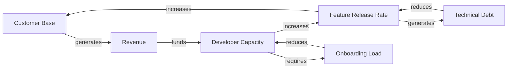
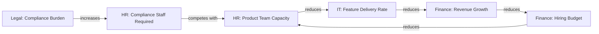

# Module 3 — Mastery: Complex Systems and Leadership

**Level**: L3 — Mastery  
**Program**: [Systems Thinking Foundations](./overview.md)  
**Duration**: ~10–12 hours self-paced + portfolio assembly  
**Prerequisite**: Module 2 pass + ≥ 2 real ST analyses contributed to GitHub issues  
**Assessment**: [Module 3 Portfolio Assessment](./assessments/module-3-quiz.md)

---

## Introduction

Mastery in Systems Thinking is not primarily about knowing more concepts — Module 2 covers all the core concepts. Mastery is about *seeing differently*: being able to look at a complex, ambiguous, multi-domain situation and rapidly identify the structural dynamics that are driving it.

Three capabilities distinguish a master practitioner:

1. **Structural diagnosis**: Quickly identifying the dominant feedback structure in an unfamiliar system
2. **Leverage identification**: Reliably locating high-leverage intervention points (not just the obvious ones)
3. **Facilitation**: Leading others through ST analysis — transferring the lens to the team

These capabilities develop through practice, not through reading alone. This module provides the conceptual scaffolding for that practice. The portfolio assessment requires evidence from real work.

---

## Part 1: Multi-Loop System Analysis

Real organizational systems are not governed by one loop. They have many reinforcing and balancing loops acting simultaneously, with different delays, interacting in ways that produce complex, non-obvious behavior.

### The method: loop-by-loop decomposition

When analyzing a complex system:

1. **List all variables** that could be relevant (don't filter yet)
2. **Identify stocks** in the list (what accumulates over time?)
3. **Map flows** into and out of each stock
4. **Trace loops**: Starting from each stock, follow the causal chain until it closes
5. **Label each loop**: R or B, with a descriptive name
6. **Identify delays** on each arc where they exist
7. **Ask: which loop currently dominates?** The dominant loop determines current behavior

### Example: A product company at growth inflection

A software product company was growing fast for 2 years. Now growth has stalled despite continued investment. Let's decompose the system.

**Variables**: Revenue, Customer base, Product quality, Technical debt, Developer capacity, Feature release rate, Customer satisfaction, Churn rate, Hiring rate, Onboarding time

**Stocks**: Customer base, Technical debt, Developer capacity, Product quality reputation

**Loops identified**:

**Loop analysis**:

| Loop | Type | Current direction | Delay |
|------|------|------------------|-------|
| R1: Growth flywheel | R | Slowing — less fuel | Revenue → hiring: 1–3 months |
| B1: Tech debt constraint | B | Dominating — this is why growth stalled | Immediate |
| B2: Onboarding | B | Secondary constraint | 4–8 weeks |

**Diagnosis**: R1 was dominant for 2 years. Now B1 has grown strong enough to constrain D (Feature Release Rate), which is the link R1 depends on. Growth hasn't stalled because of insufficient revenue or effort — it has stalled because the accumulation of technical debt has broken the critical link in the growth flywheel.

**Leverage point**: Address technical debt (Level 10 — structure of flows). Specifically: refactoring sprints to drain the technical debt stock, enabling the feature release rate to recover, allowing R1 to dominate again.

**What *won't* work**: Hiring more developers (Level 12 — parameters). They worsen B2 before they help. They don't touch the technical debt stock.

> **Exercise 3.1**: Choose a persistent, multi-domain problem in your organization. Map at least 3 loops. Identify which is currently dominant. Propose an intervention at the highest feasible leverage point.

---

## Part 2: Cross-Domain System Interactions

Most organizational problems cross domain boundaries. An HR constraint becomes a Finance constraint becomes an Operations constraint. Understanding cross-domain interactions is what separates domain-expert thinking from systems thinking.

### Common cross-domain stock interactions

| Domain A stock | Affects | Domain B stock | Mechanism |
|---------------|---------|---------------|-----------|
| HR: Team capacity | → | IT: System reliability | Fewer engineers → less maintenance time → reliability erodes |
| Finance: Cash reserves | → | HR: Hiring rate | Cash constraint → delayed hiring → capacity gap |
| Marketing: Brand equity | → | Sales: Pipeline volume | Brand builds or erodes pipeline volume with a long delay |
| IT: Technical debt | → | Operations: Delivery reliability | Debt → unexpected failures → delivery commitments missed |
| Legal: Compliance standing | → | Finance: Risk exposure | Non-compliance → potential liability → contingent financial risk |
| Governance: Standards clarity | → | All domains: Decision quality | Clear standards reduce decision latency and error rate across all domains |

### The cross-domain CLD

When mapping a cross-domain problem, use a CLD that explicitly crosses boundaries. Label stocks with their domain.

**Example: A compliance-driven staffing constraint**

Reading: Increased compliance burden (Legal) requires more compliance staff (HR), which competes for headcount with product teams (HR → IT), which reduces feature delivery (IT), which reduces revenue growth (Finance), which reduces hiring budget (Finance → HR), which further constrains product team capacity — a reinforcing loop toward constraint.

**The cross-domain insight**: A legal compliance change (seemingly a Legal domain issue) has created a reinforcing loop that constrains IT delivery and Finance growth simultaneously. No single domain lead can see this — only the cross-domain view reveals it.

> **Exercise 3.2**: Identify a problem in your domain that is actually caused or worsened by a stock in an adjacent domain. Draw the cross-domain CLD. Identify where the leverage point lies and in whose remit it falls.

---

## Part 3: Advanced Archetype Recognition — Stacked Archetypes

In simple scenarios, one archetype is active. In complex organizational systems, archetypes often stack — the naive fix for one archetype activates a second archetype.

### Stacked archetype example

**Base situation**: A product team is growing fast and hitting delivery limits. They recognize *Limits to Growth* (R1: growth flywheel pushing against B1: delivery constraint).

**Naive fix**: Add engineering headcount.

**What actually happens**: The onboarding overhead of new engineers temporarily reduces senior dev productivity, reducing delivery further. The team interprets this as the fix "not working" and doubles down — adding even more headcount. This is now *Fixes that Fail* activated by the naive fix for *Limits to Growth*.

Meanwhile, each iteration of the fix (add headcount) further buries the fundamental solution (address technical debt, the actual constraint). This is *Shifting the Burden* layered on top.

**Three archetypes active simultaneously**: Limits to Growth + Fixes that Fail + Shifting the Burden.

### How to detect stacked archetypes

Ask these questions in sequence:
1. What is the presenting problem? → Identify the primary archetype.
2. What fix has been (or will likely be) tried? → This is the "naive fix" for the primary archetype.
3. Does the naive fix have side effects that worsen the problem or a related problem? → If yes, you have *Fixes that Fail*.
4. Does the naive fix divert attention from a more fundamental solution? → If yes, you have *Shifting the Burden*.
5. Does the application of the fix compete with someone else's fix? → If yes, you may have *Escalation*.

> **Exercise 3.3**: Revisit the scenario from Exercise 2.2. Apply the stacked archetype detection questions. How many archetypes are actually active? How does this change the intervention recommendation?

---

## Part 4: Identifying High-Leverage Interventions in Practice

The theory of leverage points (Meadows 1–12) is straightforward. The practice is difficult: most situations offer many possible intervention points, and the pressure is always toward Level 12 (the parameter fix — "just do more of X").

### The leverage assessment process

For any issue requiring intervention:

1. **State the problem in structural terms**: What stock is at a bad level? What flow is too fast or too slow? Which loop is driving the problem?

2. **List possible interventions by leverage level**:
   - Level 12: What numbers could you change? (budgets, headcount, rates)
   - Level 9–10: Where are the delays and structural constraints?
   - Level 7–8: Which loops could be strengthened or accelerated?
   - Level 5–6: What rules or information flows could change?
   - Level 2–3: What goals or paradigms underlie the behavior?

3. **Assess feasibility at each level**: What authority, resources, or time does each require?

4. **Choose the highest feasible level**: Don't default to Level 12. The extra investment required for a higher-leverage intervention often has a 10× return on results.

5. **Design for side effects**: Every intervention generates side effects. Use the archetype framework to predict what will happen and design preemptively.

### Leverage point worked example

**Problem**: Technical debt is growing faster than the team can address it.

| Level | Intervention | Feasibility | Why |
|-------|-------------|-------------|-----|
| 12 | Add more engineers | Easy, familiar | Only works if onboarding delay is addressed; treats symptom |
| 10 | Restructure deployment pipeline to reduce debt introduction rate | Moderate | Addresses the flow directly |
| 9 | Shorten feedback between code change and debt measurement | Moderate | Faster signal → faster response |
| 8 | Enforce refactoring sprint quota (25% of capacity) | Moderate | Strengthens the balancing loop against debt accumulation |
| 7 | Invest in test infrastructure (accelerates refactoring ROI) | Higher initial cost, lasting effect | Accelerates the capability reinforcing loop |
| 6 | Make debt visible in a public dashboard (CI/CD metric) | Low cost | Changes information flow → changes behavior without mandate |
| 5 | Policy: No feature release without debt ceiling check | Structural | Changes the rules of every future release |

**Recommendation**: Levels 5 (policy) + 6 (dashboard) + 7 (test investment) in combination. Level 5 changes the rules, Level 6 makes the rule visible in real time, Level 7 makes compliance easier than non-compliance. This combination is more durable than any single intervention.

---

## Part 5: Facilitating ST Analysis Sessions

Mastery means you can transfer the ST lens to others. A facilitated ST analysis session is the primary mechanism for this.

### Session structure (60–90 minutes)

**Before the session**:
- Select a real issue or recurring problem from the team's current work
- Prepare by doing your own preliminary ST analysis (loops, archetype hypothesis, leverage candidates)
- Do not share your analysis in advance — the session should surface the team's own structural understanding

**Opening (5 min)**:
> "We're going to look at this problem not by asking 'who should fix it' but by asking 'what is the structure that keeps producing this outcome.' I'll ask questions and we'll map what you tell me."

**Phase 1: Identify the stocks (10 min)**:
> "What is actually accumulating here? What would we measure to know if things are getting better or worse?"

Draw the stocks on a whiteboard/shared doc. Get 3–5.

**Phase 2: Map the flows (10 min)**:
> "What fills each stock? What drains it? How fast?"

**Phase 3: Trace the loops (20 min)**:
> "When [stock A] grows, what else changes? Does that change come back to affect [stock A]?"

Close the loops. Label them R or B. Name them descriptively.

**Phase 4: Identify delays (10 min)**:
> "Between [action] and [effect] — how long does that actually take? What happens in the meantime?"

**Phase 5: Archetype check (10 min)**:
> "Has anyone seen this pattern before? Does this remind you of any of the 7 archetypes?"

**Phase 6: Leverage assessment (15 min)**:
> "Given what we've mapped — where would a small change have the largest effect? Not the easiest place — the highest-leverage place."

**Debrief (5 min)**:
- What surprised the team about this analysis?
- What would they have done differently without the structural view?
- Who will write up the ST analysis for the issue?

### Facilitation pitfalls

| Pitfall | Signal | Correction |
|---------|--------|-----------|
| **Attribution focus** | Team keeps naming people as causes | Redirect: "Assume everyone in the story is doing their best. What is the structure that made that outcome likely?" |
| **Solution jumping** | Team skips analysis and proposes fixes | "Let's stay in diagnosis mode a bit longer. What's the loop that keeps producing this?" |
| **Overwhelm** | Too many variables, no clear structure | "Let's start with just the most important stock. What is the one number that tells us if this problem is improving?" |
| **Archetype forcing** | Team assigns an archetype that doesn't quite fit | "Let's check: does the fix really create a side effect that worsens the original problem, or is something else happening?" |

---

## Part 6: Train-the-Trainer

After completing Module 3, your primary contribution to ST capability in the organization is multiplying it: mentoring others through L1 and L2.

### Mentoring an L1 learner

1. Have them complete Module 1 independently first.
2. Review their exercises together. Focus on the mental model shift (Part 1) — if they're still thinking linearly, the vocabulary won't help.
3. Present a domain-specific scenario. Ask them to identify stocks and flows before you do.
4. Review the Module 1 quiz with them after they've taken it — not to correct answers, but to understand their reasoning.

### Mentoring an L2 learner

1. Have them attempt the Module 2 exercises independently.
2. Review their CLD drawing. Check: Are links labeled directionally? Are loops closed? Are delays marked?
3. Review their ST analysis. Check: Did they identify the dominant loop? Did they assign an archetype? Is the leverage point justified?
4. Co-analyze a real GitHub issue with them before they submit their own analysis independently.

### The teaching reinforcement loop

Teaching accelerates your own mastery. When you explain a concept, gaps in your own understanding become visible. Use them:

> "I'm not sure exactly how to draw this — let me think through it with you."

This is not a failure of mastery. It is mastery in practice.

---

## Module Summary

| Capability | Developed through |
|-----------|------------------|
| Multi-loop analysis | Decomposing complex systems loop by loop; identifying dominant structure |
| Cross-domain interaction | Mapping stock-flow relationships across domain boundaries |
| Stacked archetypes | Detection sequence: primary → Fix that Fails → Shifting the Burden → Escalation |
| Leverage assessment | Listing interventions by level; choosing highest feasible level; designing for side effects |
| Facilitation | 60–90 min session structure; pitfall recognition; keeping team in diagnosis mode |
| Mentoring | L1: mental model check; L2: CLD and analysis review; co-analysis before solo |

---

## Next Step

Assemble your portfolio for the [Module 3 Portfolio Assessment](./assessments/module-3-quiz.md).

The portfolio requires:
1. ≥ 2 real GitHub issue ST analyses (linked)
2. ≥ 1 CLD committed to `docs/models/`
3. ≥ 1 facilitation session (documented)
4. ≥ 1 peer review of a colleague's ST analysis

Team lead signs off on completion. Record in [Progress Tracker](./assessments/progress-tracker.md).
